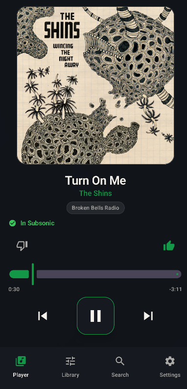
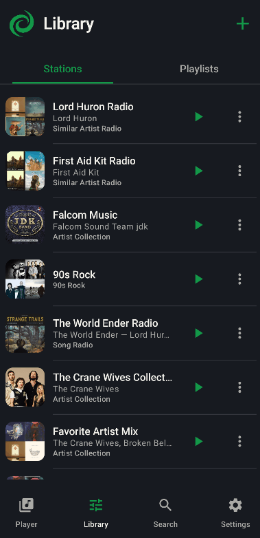
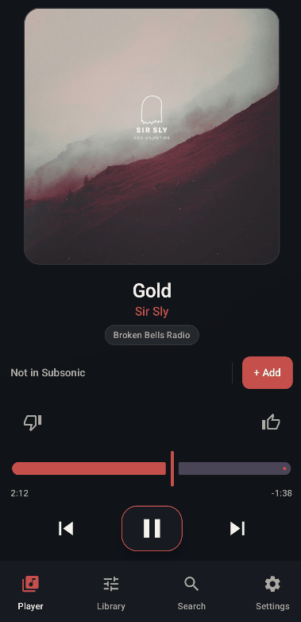
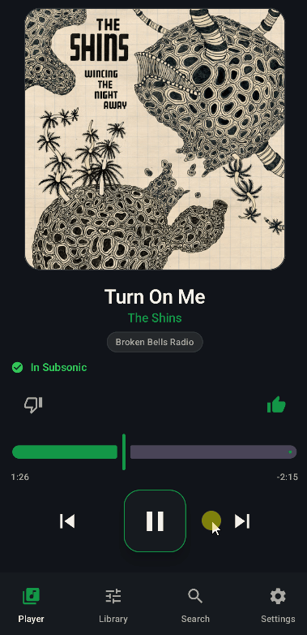
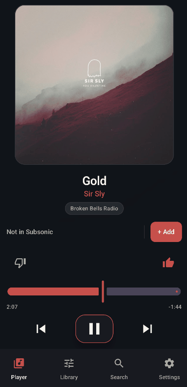

# Helix for Android

Native Android client for [Helix](https://github.com/UnifiedKings/helix), the self-hosted music discovery, playback, and fulfillment platform.

Helix for Android connects to an existing Helix server for music discovery, playback, queue management, stations, playlists, and Subsonic integration.

> **Status:** Work in progress. The Android app is under active development and features may change.

<p align="center">
  
</p>

## Features

- Native Android playback with Media3 / ExoPlayer
- Android media session, notification, and lock-screen controls
- Playback synchronized with the Helix server
- Swipe-up queue drawer from Now Playing
- Queue management and reordering
- Song, album, and artist search
- Album and artist browsing
- Helix station browsing, playback, creation, and editing
- Playlist browsing and playback
- Liked and disliked songs
- Subsonic availability detection on Now Playing
- Add missing tracks to Subsonic directly from the app
- Native Android appearance customization
- Configurable playback behavior
- Support for playback started or changed by other Helix clients

### Stations

Browse and start the same Helix stations available on your server directly from the Android app.

<p align="center">
  
</p>

## Requirements

Helix for Android is a client and requires a running Helix server.

You will need:

- An Android device
- A running Helix instance
- Network access from the Android device to the Helix server

Helix itself handles the shared queue, stations, playlists, music discovery, Subsonic integration, and track fulfillment.

## Installation

Download the latest compiled Android APK from the **[Helix for Android Releases](https://github.com/UnifiedKings/helix-android/releases)** page.

Install the provided APK on your Android device.

Depending on your Android version and browser or file manager, Android may ask you to allow installation from that source before the APK can be installed.

Once installed, open Helix and connect it to your existing Helix server.

## Connecting to Helix

After launching the app:

1. Open **Settings**
2. Open **Account**
3. Enter your Helix server URL
4. Enter your Helix username and password
5. Connect

<p align="center">
  
</p>

Example remote URL:

```text
https://helix.example.com
```

Example local-network URL:

```text
http://192.168.1.100:8000
```

Your Android device must be able to reach the address you enter.

HTTPS is strongly recommended when accessing Helix outside a trusted local network.

## Playback Architecture

Helix remains the source of truth for playback and queue state.

The Android app uses Media3 / ExoPlayer for local playback and Android media-session integration. Transport actions such as Previous and Next are captured by the app and sent to Helix, which decides what should actually play.

This keeps the Android client synchronized with playback changes made from other Helix clients, including the web frontend.

Natural track completion is also reported back to Helix so queue and station behavior remain server-controlled.

## Queue

The queue is intentionally hidden on the main Now Playing screen.

Swipe upward on the player to open the queue as a drawer. This keeps Now Playing focused on the current track while leaving the full queue immediately accessible.

<p align="center">
  
</p>

## Subsonic Integration

The Android app uses Helix's existing Subsonic integration rather than managing the music library directly.

From Now Playing, the app can:

- Detect whether the current track already exists in Subsonic
- Display **In Subsonic** when it is available
- Request that Helix add a missing track to Subsonic
- Keep the Add action disabled while the import is pending
- Update automatically once Helix detects the track in Subsonic

## Appearance

Helix for Android has its own native appearance settings independent of the Helix web frontend.

Currently configurable:

- Accent color
- Background color
- Surface color
- Color presets
- Visual custom color picker

These settings are stored locally on the Android device and do not modify the appearance of the Helix web interface.

<p align="center">
  
</p>

## Building from Source

This section is only for developers who want to build or modify Helix for Android themselves.

You will need:

- Android Studio
- Android SDK / Gradle tooling
- An Android device or emulator for testing

Clone the repository:

```bash
git clone https://github.com/UnifiedKings/helix-android.git
cd helix-android
```

Open the project in Android Studio, allow Gradle to sync, then select an Android device or emulator and press **Run**.

## Technology

- Kotlin
- Jetpack Compose
- Android Media3 / ExoPlayer
- Retrofit
- OkHttp
- Coil

## Related Projects

- [Helix](https://github.com/UnifiedKings/helix) — Main Helix server and web application
- [HelixBot](https://github.com/UnifiedKings/helixbot) — Discord playback client for Helix

## Contributing

Helix for Android is still under active development.

Bug reports, testing, and contributions are welcome through GitHub issues and pull requests.

## License

Helix for Android is licensed under the **GNU Affero General Public License v3.0 (AGPL-3.0)**.

See [LICENSE](LICENSE) for the full license text.
